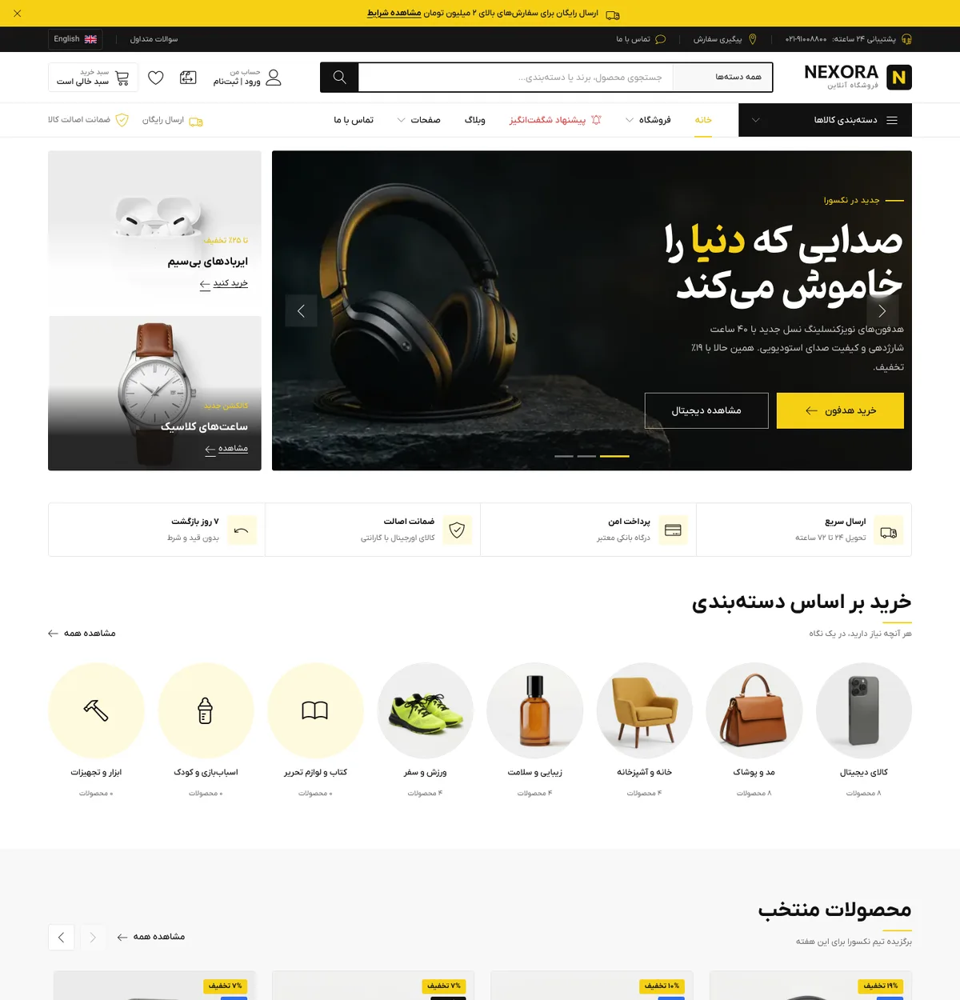

# Nexora — Premium Multi‑Category E‑Commerce HTML Template

> RTL‑first (Persian) with a fully mirrored English/LTR build. Vanilla JS, no jQuery.
> Design DNA reverse‑engineered from the *Creek* reference template (see `docs/01-reference-analysis.md`).



## Contents

| Path | What it is |
| --- | --- |
| `*.html`, `product/*.html`, `blog/*.html` | **Persian (RTL) build** — ready‑to‑deploy static pages |
| `en/**` | **English (LTR) build** — same pages, mirrored |
| `assets/css/` | Design system: `tokens.css` → `base.css` → `layout.css` → `components.css` → `pages.css` (+ `fonts.css`, `icons.css`) |
| `assets/js/app.js` | Runtime bundle (built from `src/js`), `app.min.js` minified |
| `assets/js/catalog.{fa,en}.js`, `i18n.{fa,en}.js` | Generated data/strings for the runtime (cart, search, filters, quick view…) |
| `assets/vendor/` | Swiper 11, PhotoSwipe 5, Bootstrap 5 grid (RTL + LTR) — all local, no CDN |
| `assets/fonts/` | IRANYekan, Pinar (from the reference), Inter (EN), Linearicons subset (186 glyphs, 32 KB) |
| `assets/img/` | Sample WebP imagery (products, hero, banners, categories, blog) |
| `assets/icons/sprite.svg` | Brand / payment / flag / logo SVG symbols |
| `src/` | **Source of truth**: templates, data, locales, JS modules |
| `scripts/build.mjs` | Static site generator + esbuild bundler |
| `docs/01-reference-analysis.md` | Full reverse‑engineering report and architecture decisions |

## Pages (× 2 languages)

Home · Shop (filters, sort, pagination, grid/list, URL‑synced) · Product (28 static pages + `product.html?slug=` dynamic fallback) · Search · Cart · Checkout (+ success) · Wishlist · Compare · Login · Register · Forgot password (OTP) · Account dashboard · Orders · Order detail · Account wishlist · Addresses · Profile · Blog · Single post (6 posts) · About · Contact · FAQ · Terms · 404

## Quick start

```bash
npm install          # devDependencies only (esbuild + vendor sources)
npm run build        # → regenerates all HTML + assets/js/app.js
npm run serve        # http://localhost:8080
npm run watch        # rebuild on change in src/
```

The generated HTML works from any static host (or `file://` for a quick look — all vendors are classic scripts).

## Editing the template

* **Copy / strings** → `src/locales/fa.json`, `src/locales/en.json`
* **Products / categories / brands / reviews / posts** → `src/data/*.json` (all text fields are `{ "fa": …, "en": … }`)
* **Layout & partials** → `src/templates/layouts/base.html`, `src/templates/partials/*.html`
* **Pages** → `src/templates/pages/*.html` (Mustache‑like syntax: `{{var}}`, `{{{raw}}}`, `{{#if}}`, `{{#each}}`, `{{> partial}}`, helpers `{{t "key" n=…}}`, `{{icon "cart" size="sm"}}`, `{{price 1200000}}`, `{{{cards lists.featured}}}`)
* **Runtime behaviour** → `src/js/` (`core/` shared renderers used by both build and browser, `components/`, `pages/`, `store/state.js` for the localStorage cart/wishlist/compare)
* **Design tokens** → `assets/css/tokens.css` (colours, type scale, spacing, radii, shadows, motion, z‑index)
* **Typeface swap** → `assets/css/fonts.css` (`primary-font` / `secondary-font` aliases, like the reference)

## Architecture notes

* **BEM** class naming, `is-*` state classes, CSS custom properties, logical properties (`inline-size`, `margin-inline-start`) so one stylesheet serves RTL and LTR.
* **Responsive**: mobile‑first; breakpoints 576 / 768 / 992 / 1200 / 1400. Product grid 2 → 3 → 4 columns; sidebar filters move into an off‑canvas drawer < 992 px; compact header + bottom tab bar on mobile; sticky buy bar on product pages.
* **Accessibility**: semantic landmarks, one `h1` per page, real `<button>`/`<a>`, `aria-*` for tabs/dialogs/drawers/menus, `:focus-visible` rings, focus trapping in drawers, live regions for toasts, `prefers-reduced-motion` respected, hover effects only under `@media (hover: hover)`.
* **SEO**: unique titles/descriptions, canonical + `hreflang` pairs, Open Graph, JSON‑LD (`WebSite`, `BreadcrumbList`, `Product` with offers/ratings, `BlogPosting`), `sitemap.xml`, `robots.txt`.
* **Performance**: WebP images with `width/height` + `loading="lazy"`, `fetchpriority="high"` for LCP images, font subsetting, preloads, no jQuery, ~96 KB minified runtime.
* **Icons**: Linearicons (the reference's icon system) subset to the used glyphs, plus an inline SVG sprite for brand/payment marks. No emoji anywhere.

## Libraries kept / dropped vs. the reference

Kept & upgraded: **Swiper** (3.4 → 11), **PhotoSwipe** (4.1 → 5), **Bootstrap grid** (4 beta → 5.3 RTL/LTR), **Linearicons**, IRANYekan/Pinar fonts.
Dropped (replaced by native APIs / CSS): jQuery, Owl Carousel, Slick, Isotope, Magnific Popup, Regula (validation), WOW.js (→ IntersectionObserver reveal), Select2, Font Awesome, Material Design Icons, RD Navbar. Full rationale in `docs/01-reference-analysis.md §3`.

## Demo behaviour

Cart, wishlist, compare, recently‑viewed, coupon (`NEXORA10`, `WELCOME`) and the login session are persisted in `localStorage`. Forms validate client‑side and simulate submission with toasts; no backend is required.
